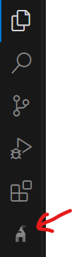

import Tabs from '@theme/Tabs';
import TabItem from '@theme/TabItem';

# Getting Started

## Quick Install

<Tabs>
  <TabItem value="windows" label="Windows" default>
    ```bash
    1. Ctrl+Shift+X
    2. Search "GoatSwitch AI Chat"
    3. Click Install
    ```
  </TabItem>
  <TabItem value="mac" label="Mac">
    ```bash
    1. Cmd+Shift+X
    2. Search "GoatSwitch AI Chat"
    3. Click Install
    ```
  </TabItem>
</Tabs>

:::info Alternative
Install directly via [VSCode Marketplace](https://marketplace.visualstudio.com/items?itemName=GoatSwitchAI.goatswitchaichat)
:::

## Verify Installation

After installing, verify the installation by checking if the GoatSwitch goat icon is present in the activity bar of VSCode.


