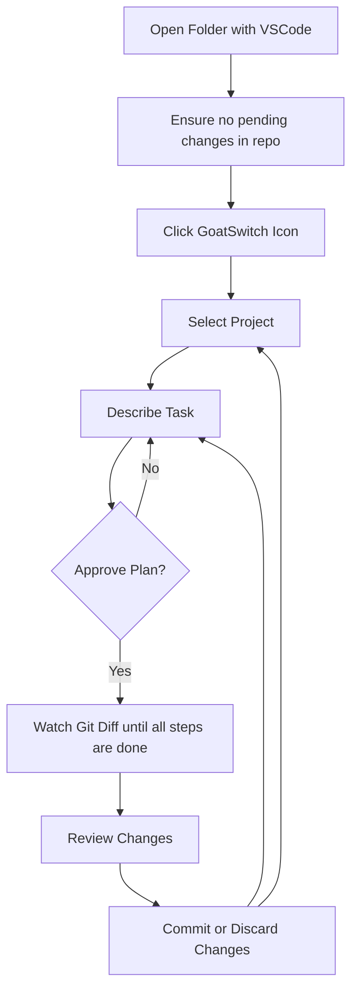

import Tabs from '@theme/Tabs';
import TabItem from '@theme/TabItem';

# Using GoatSwitch AI

## Basic Workflow



## Example Tasks

<Tabs>
  <TabItem value="dotnet" label=".NET" default>
    ```plaintext
    - "Upgrade to .NET 8"
    - "Refactor legacy code patterns"
    - "Remove deprecated APIs"
    - "Switch to Entity Framework Core"
    - "Integrate library X"
    - "Switch to library Y"
    ```
  </TabItem>
  <TabItem value="java" label="Java">
    ```plaintext
    - "Integrate Java 21 features"
    - "Update to Spring Boot 3"
    - "Refactor legacy code patterns"
    - "Remove deprecated APIs"
    - "Switch to Hibernate"
    - "Integrate library X"
    - "Switch to library Y"
    ```
  </TabItem>
</Tabs>
